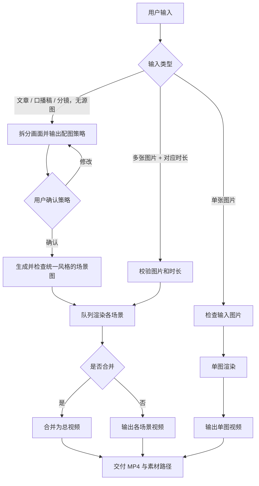

# Whiteboard Stream Animation

把一张插图渲染为连续落笔、逐步上色、最后停留展示的白板手绘动画，并导出 H.264 MP4。适合故事绘本、知识讲解、课程配图和短视频素材。


## 演示效果

下面的案例由一张“猴子山抢香蕉”的手绘插图生成：画面先连续绘制深色线稿，再以原图颜色回填，最后停留展示完整画面。


源视频：[`stream_20260726_235350_h264.mp4`](assets/whiteboard/zoo-story/rendered/stream_20260726_235350_h264.mp4)

## 特性

- 连续笔迹：笔尖沿实际绘制轨迹移动，而不是逐帧跳变。
- 三段式节奏：起笔（线稿）→ 添彩（回填）→ 凝视（完整画面停留）。
- 两种笔迹路径：稳定的网格路径，或更贴合线条的骨架路径。
- 两种添彩方式：轮廓感知扫色与沿轨迹刷色。
- 默认叠加手部/笔尖，也支持关闭或替换为自定义素材。
- 支持批量渲染多张图，并可按顺序合并为一条完整视频。
- 不依赖系统级 FFmpeg 也能通过 PyAV 输出 H.264；安装 FFmpeg 后可获得更灵活的处理能力。

## Skill 工作流

这个 Skill 的目标不是“给一张图就直接转视频”，而是根据用户提供内容选择正确的生产路径，并在没有源图时先完成分镜与配图确认。



### 1. 文章、口播稿或分镜：先配图，后渲染

当用户只提供文字内容而没有图片时，必须遵循以下顺序：

1. 阅读内容，按语义拆分场景；每幕只表达一个核心意思，通常承载 2.5–5 秒口播。
2. 输出配图策略：包含场景编号、核心表达、画面主体及对应的口播片段。
3. **等待用户确认配图策略。未确认前，不生成图片，也不开始渲染。**
4. 确认后，为每幕生成并检查 16:9 源图；发现文字、主体不清晰、对象重叠或风格不一致时，先重做该图。
5. 将通过检查的图片保存到 `assets/whiteboard/<项目名>/`，再用队列模式逐幕渲染；用户需要完整成片时开启 `--merge`。

生成场景图时，整组画面必须保持统一：暖米黄色纸张背景 `#F5EBD7`、深灰线稿、少量橙色 `#FFA500` 点缀、干净留白、简约手绘风格；禁止生成文字、标签、水印、写实摄影或复杂密集背景。

### 2. 单张图片：直接渲染

当用户提供一个图片路径时，先确认文件存在且为 PNG、JPG、JPEG、BMP 或 TIFF。建议使用浅色背景、轮廓清晰、主体留有空白的画面；检查通过后进入单图渲染。

动画固定分为三个阶段：

1. **起笔（ink）**：笔尖沿连续轨迹绘制黑白线稿。
2. **添彩（color）**：笔尖沿轨迹回扫，以原图颜色点亮画面。
3. **凝视（gaze）**：收笔后保留完整彩色画面，方便观众观看。

### 3. 多张图片：队列渲染

当用户提供多张图片和一一对应的时长数组时，先校验三项：图片数量与时长数量一致、每个文件存在、每个时长为正整数。校验通过后逐张渲染，默认保留所有独立片段；用户明确希望串成完整视频时，再使用 `--merge` 合并。

### 4. 交付标准

完成后向用户交付：成功/失败数量、输出目录、每个独立视频路径，以及（如启用合并）总视频路径。单图渲染以 `OUTPUT=` 输出最终文件；队列合并以 `MERGED=` 输出总视频。

## 安装

```bash
git clone https://github.com/geeklee/whiteboard-stream-animation.git
cd whiteboard-stream-animation

python scripts/prepare_env.py
```

安装脚本会创建 `.venv` 并安装所需依赖。完成后会在终端输出 `ENV_PY`，后续命令使用该 Python 路径即可。

## 快速开始

将一张 PNG、JPG、JPEG、BMP 或 TIFF 图片渲染为 12 秒视频：

```bash
<ENV_PY> scripts/stream_render.py ./examples/monkey-mountain.png \
  --out-dir ./out \
  --total-ms 12000
```

渲染完成后，终端会输出最终文件路径：

```text
OUTPUT=out/stream_YYYYMMDD_HHMMSS_h264.mp4
```

## 批量渲染与合并

为每张图指定对应时长（单位：毫秒），并在完成后合并为一条视频：

```bash
<ENV_PY> scripts/queue_render.py \
  --images ./examples/scene-01.png ./examples/scene-02.png \
  --durations 15000 14000 \
  --out-dir ./out \
  --merge \
  --merged-name zoo-story.mp4
```

批量渲染会保留每张图的独立视频；开启 `--merge` 后，额外输出按输入顺序硬切合并的总视频。

## 常用参数

| 参数 | 默认值 | 说明 |
| --- | --- | --- |
| `--out-dir` | `./out` | 输出目录 |
| `--total-ms` | `10000` | 单图视频总时长，单位为毫秒 |
| `--bare-tip` | 关闭 | 不叠加默认的手部/笔尖素材 |
| `--pen-image` | 内置素材 | 使用自定义手部或笔尖 PNG |
| `--ink-path` | `grid` | 线稿路径：`grid` 稳定；`skeleton` 更贴合细线条 |
| `--color-fill` | `contour-wipe` | 上色方式：`contour-wipe` 轮廓扫色；`brush` 轨迹刷色 |
| `--pause` | `heavy` | 起笔停顿节奏：`heavy`、`auto`、`light`、`off` |
| `--fps` | `60` | 输出帧率 |
| `--merge` | 关闭 | 批量模式下合并所有成功片段 |
| `--fail-fast` | 关闭 | 批量模式遇到错误后立刻停止 |

推荐从默认配置开始。对于线条清晰的插画，尝试 `--ink-path skeleton` 能得到更贴合轮廓的笔迹；对于照片或细节较多的画面，默认的 `grid` 通常更稳定。

## 输入图片建议

- 使用浅色或纯色背景，主体与背景的对比尽量明确。
- 留出适当空白，避免主要对象大面积重叠。
- 统一使用相同画幅和视觉风格后再批量渲染，合并视频会更自然。
- 简笔画、线稿、扁平插画通常最适合 `skeleton` 路径。

## 项目结构

```text
whiteboard-stream-animation/
├── SKILL.md              # 面向 Agent 的工作流与约束
├── README.md             # 本文档
├── LICENSE               # MIT
├── .gitignore
├── scripts/
│   ├── prepare_env.py     # 环境检测与依赖安装
│   ├── stream_render.py   # 单图渲染
│   ├── queue_render.py    # 批量渲染与合并
│   └── test_stream_render.py  # 渲染测试
├── assets/
│   ├── drawing-hand.png   # 默认手部/笔尖素材
│   └── whiteboard/        # 演示素材
└── agents/
    └── openai.yaml        # Codex 元数据
```

## License

本项目基于 [MIT License](LICENSE) 开源，可自由使用、修改和分发。依赖（`opencv-python`、`numpy`、`av`）由 `scripts/prepare_env.py` 在 `.venv` 中自动安装，各自遵循其原始许可证。

## 关于作者

一个爱养鱼的老登 / AI Builder / 用 AI 团队打造一人公司。

抖音、B站、公众号：**江哥是老登啊**
